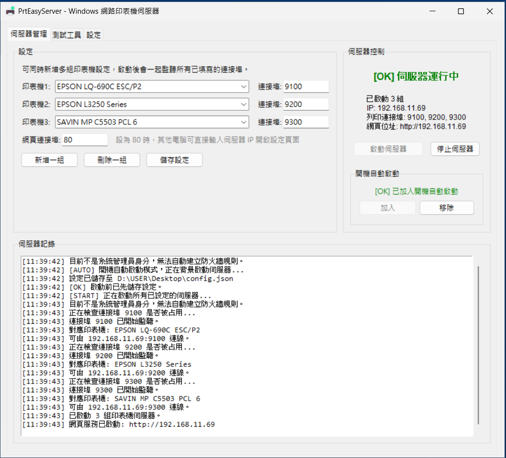
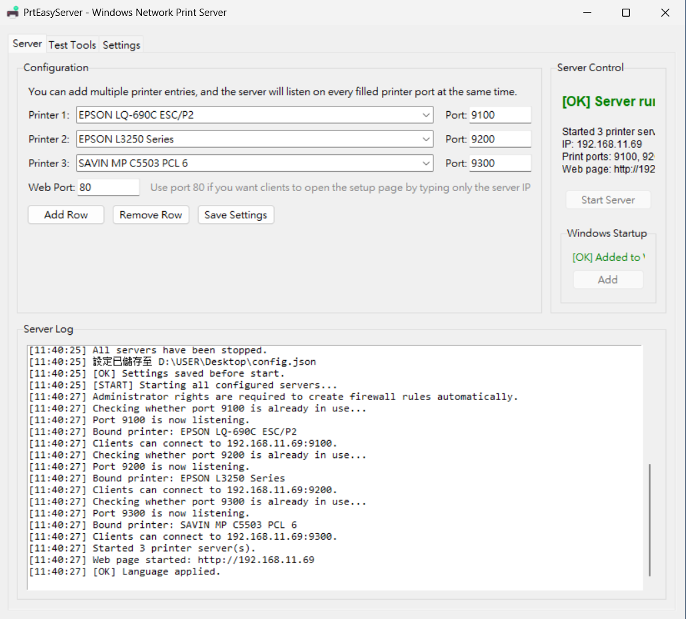
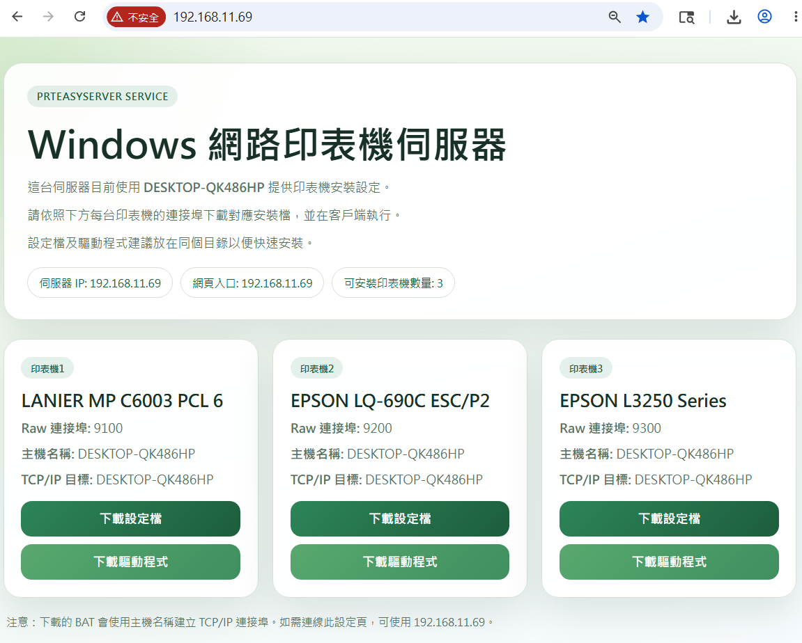
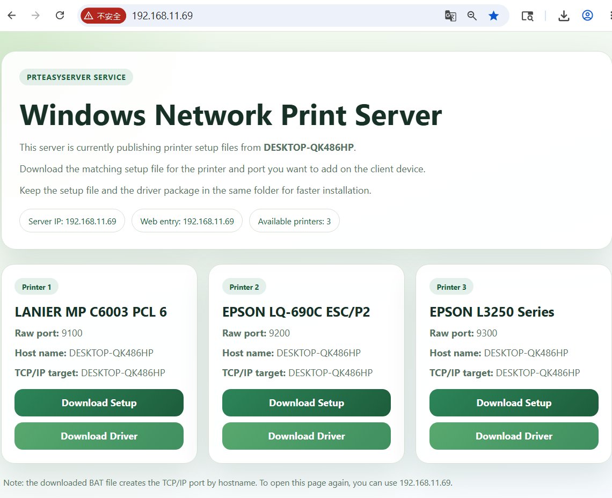

# PrtEasyServer

Windows Network Print Server for local printers.

English | [繁體中文](#zh-tw)

PrtEasyServer turns a Windows local printer into a TCP/IP network printer server. It focuses on simple RAW 9100 sharing, avoids SMB printer sharing, and lets client PCs install printers through IP port setup without Windows file sharing credentials.

## Version History

### v1.1.1.0

- The installer BAT no longer launches PowerShell through Base64-encoded script content.
- It now uses a readable UTF-8 embedded PowerShell script that is extracted and executed at runtime.
- Chinese and English installer messages are preserved while improving readability and reducing suspicious script patterns.

### v1.1.0.0

- Added a built-in web page for downloading both the installer BAT and the matching driver package.
- Added automatic driver-package handling so the client PC can try driver installation before falling back to manual setup.
- Added bilingual web page and installer messaging, multi-printer management polish, and improved build metadata for the packaged EXE.

### v1.0.0.0

- Initial public release of PrtEasyServer.
- Shared local Windows printers over RAW 9100 TCP/IP ports without SMB printer sharing.
- Included the desktop management UI, startup support, tray behavior, and the basic printer setup workflow.

## Highlights

- Share one or more local printers at the same time
- RAW 9100 print server for standard TCP/IP printer port setup
- No SMB printer sharing, no network neighborhood password prompt
- Built-in web page for printer list and installer download
- Installer BAT is generated dynamically for each shared printer
- Chinese and English UI, web page, and installer messages
- Hostname-first printer connection flow for changing LAN IP environments
- Auto firewall rule check when app starts or services start
- Minimize to tray and startup support

## Screenshots

### Traditional Chinese Desktop UI

### English Desktop UI

### Traditional Chinese Web Page

### English Web Page

## Video Demo

Click the preview below to watch the YouTube demo:

- YouTube: [https://youtu.be/uwNWGIuaMrA](https://youtu.be/uwNWGIuaMrA)

## Download

- Latest releases: [Releases](https://github.com/Terence0816/Windows-PrtEasyServer/releases)
- Official `v1.1.1.0` download: [PrtEasyServer.exe](https://github.com/Terence0816/Windows-PrtEasyServer/releases/download/v1.1.1.0/PrtEasyServer.exe)
- The release page also shows the current download count for the official build

## Typical Usage

1. Connect your printer to the Windows PC.
2. Select one or more printers in PrtEasyServer and assign ports such as `9100`, `9200`, or `9300`.
3. Start the server.
4. Open the built-in web page from another PC and download the installer BAT for the target printer.
5. Run the BAT on the client PC to create the TCP/IP port and install the printer with the matching driver.

## Search Keywords

Windows print server, network printer server, RAW 9100, TCP/IP printer sharing, USB printer sharing, printer host, no SMB printer sharing, IP printer setup, Windows local printer to network printer

## Credits

This project is based on PrinterOne by xtieume.  
Original project: https://github.com/xtieume/PrinterOne

Original attribution:

- Original Copyright (c) 2025 xtieume@gmail.com
- This repository contains modifications, UI changes, multilingual support, web installer download flow, multi-printer support, and packaging updates by Terence0816

## License

This repository is released under the MIT License. See [LICENSE](./LICENSE).

---

# 繁體中文

PrtEasyServer 是一個 Windows 網路印表機伺服器，可以把本機印表機轉成 TCP/IP 網路印表機。它主打簡單的 RAW 9100 分享方式，不需要使用 Windows 網芳或 SMB 印表機分享，也不需要讓用戶碰到帳號密碼提示。

## 版本更新紀錄

### v1.1.1.0

- 安裝 BAT 不再使用 Base64 編碼的 PowerShell 啟動方式。
- 改為可讀的 UTF-8 明文嵌入式 PowerShell 腳本，執行時再抽出使用。
- 保留中英文安裝訊息，同時讓內容更容易檢查，也降低部分可疑腳本特徵。

### v1.1.0.0

- 新增內建網頁，可直接下載安裝 BAT 與對應的驅動程式封裝。
- 新增驅動程式自動安裝流程，讓用戶端可先嘗試自動安裝，再視情況回退手動安裝。
- 補強中英文網頁、安裝訊息、多印表機管理細節，以及 EXE 打包版本資訊。

### v1.0.0.0

- PrtEasyServer 首次公開版本。
- 可將本機 Windows 印表機透過 RAW 9100 方式分享成 TCP/IP 網路印表機，不需 SMB 印表機分享。
- 內含桌面管理介面、系統匣/開機啟動支援，以及基本的印表機安裝流程。

## 功能特色

- 可同時分享多台本機印表機
- 採用 RAW 9100 列印服務，適合標準 TCP/IP 連接埠安裝
- 不使用 SMB 印表機分享，不會跳出網芳帳密問題
- 內建網頁頁面，可列出所有分享中的印表機
- 每台印表機都可下載專屬安裝 BAT
- 介面、網頁、安裝訊息支援中文與英文
- 以主機名稱為優先建立連線，較適合內部 IP 會變動的環境
- 程式啟動或伺服器啟動時可自動檢查防火牆規則
- 支援最小化到系統匣與開機自動啟動

## 畫面預覽

### 中文桌面介面

### 英文桌面介面

### 中文網頁介面

### 英文網頁介面

## 影片示範

點擊下方預覽圖即可開啟 YouTube 示範影片：

- YouTube 影片連結：[https://youtu.be/uwNWGIuaMrA](https://youtu.be/uwNWGIuaMrA)

## 下載

- 版本下載頁面：[Releases](https://github.com/Terence0816/Windows-PrtEasyServer/releases)
- 正式版 `v1.1.1.0`：[PrtEasyServer.exe](https://github.com/Terence0816/Windows-PrtEasyServer/releases/download/v1.1.1.0/PrtEasyServer.exe)
- GitHub 發行頁右側與上方徽章都可以看到目前的下載次數

## 使用方式

1. 將印表機接到 Windows 電腦。
2. 在 PrtEasyServer 中選擇一台或多台印表機，並指定 `9100`、`9200`、`9300` 等連接埠。
3. 啟動伺服器。
4. 在其他電腦開啟內建網頁，下載對應印表機的安裝 BAT。
5. 在用戶端執行 BAT，自動建立 TCP/IP 連接埠，並用對應驅動安裝印表機。

## 適用情境

- 公司或家庭中有 USB 印表機，需要快速分享成 IP 印表機
- 不希望使用 Windows 網芳分享
- 不想讓使用者碰到帳號密碼驗證
- 分享主機的區網 IP 可能變動，但電腦名稱固定

## 搜尋關鍵字

Windows 印表機伺服器、網路印表機伺服器、RAW 9100、TCP/IP 列印、USB 印表機分享、IP 印表機、無 SMB 分享、無網芳帳密、印表機安裝 BAT

## 原作與致謝

本專案基於 PrinterOne 修改而成。  
原始專案：https://github.com/xtieume/PrinterOne

原作資訊：

- Original Copyright (c) 2025 xtieume@gmail.com
- 本專案由 Terence0816 進行後續修改，包含介面調整、多語系、內建網頁、安裝 BAT、多印表機支援與封裝調整

## 授權

本儲存庫目前使用 MIT License，詳見 [LICENSE](./LICENSE)。
